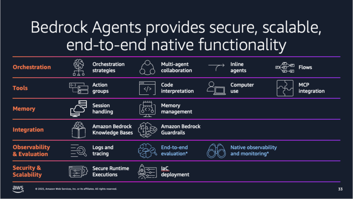
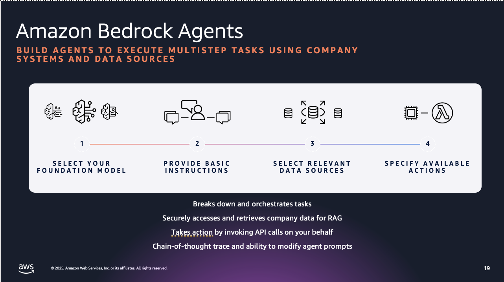

# Build and Scale Agentic AI with AWS

  

## Introduction

Agentic AI refers to systems that can autonomously perform complex tasks, make decisions, and interact with users or environments in a goal-oriented manner. These systems leverage *Generative AI (GenAI)* to understand context, generate responses, and orchestrate workflows. Amazon Web Services (AWS) provides a robust ecosystem of tools and services to build, deploy, and scale agentic AI use cases.

This guide will help hackathon participants:

1. Understand AWS's GenAI approach.
2. Explore key AWS services for building agentic AI.
3. Learn how to design and implement agentic AI use cases.
4. Follow best practices for security, scalability, and cost-efficiency.

---

## AWS Generative AI Approach

AWS's GenAI approach is built on three pillars: **Accessibility**, **Customization**, and **Scalability**. AWS enables customers to leverage GenAI through a flexible, layered architecture that supports a wide range of use cases, from simple chatbots to complex agentic workflows.

### AWS GenAI Principles

1. *Choice of Models*: AWS offers access to a variety of foundation models (FMs) through **Amazon Bedrock**, including models from Anthropic, Meta AI, Mistral, and Amazon's own Titan & Nova models. This allows developers to select the best model for their use case.

2. *Customization*: Developers can fine-tune models or use Retrieval-Augmented Generation (RAG) to tailor AI outputs to specific domains or datasets.

3. *Tool Integration*: AWS enables agents to interact with external tools, APIs, and data sources, making them "agentic" by allowing autonomous task execution.

4. *Security and Governance*: AWS prioritizes responsible AI with features like encryption, access control, and guardrails for safe AI outputs.

5. *Scalability*: AWS's serverless and managed services ensure agentic AI solutions can scale seamlessly to handle enterprise-grade workloads.

### AWS GenAI Stack

AWS organizes its GenAI services into a three-layer stack:

1. *Layer 1: Foundation Models (Amazon Bedrock)* : Access to pre-trained, high-performing models for text, image, and multimodal tasks. Example: Anthropic's Claude for reasoning, Amazon Titan for text generation.

2. *Layer 2: Customization and Orchestration:* Tools like Amazon Bedrock's Knowledge Bases, Agents, and Fine-Tuning enable domain-specific customization and workflow orchestration.

3. *Layer 3: Application Development:* Integrate GenAI into applications using AWS Lambda, Amazon API Gateway, and Amazon SageMaker for custom ML pipelines.

---

## AWS managed services for Agentic AI use-cases

Below are the core AWS services for building agentic AI use cases, along with their roles:

1. *Amazon Bedrock*

- *Purpose*: Managed service for accessing and customizing foundation models.

- *Use for Agentic AI*:

- Build conversational agents with models like Claude or Titan.

- Create agents that can call external APIs or tools (e.g., via Bedrock Agents).

- Implement RAG for context-aware responses using Knowledge Bases.

- *Example*: An AI agent that retrieves customer data from a CRM and generates personalized responses.

3. *AWS Lambda*

- *Purpose*: Serverless compute service for running code in response to events.

- *Use for Agentic AI*:

- Execute tasks triggered by AI agents (e.g., updating a database or calling an API).

- Integrate with Bedrock for low-latency agent responses.

- *Example*: An agent that processes user requests and triggers Lambda functions to update inventory.

4. *Amazon API Gateway*

- *Purpose*: Create and manage APIs to connect AI agents with external systems.

- *Use for Agentic AI*:

- Expose agent functionalities as RESTful APIs.

- Enable secure communication between agents and third-party services.

- *Example*: An API that allows an AI agent to query a weather service for real-time data.

5. *Amazon S3*

- *Purpose*: Scalable object storage for storing datasets, model artifacts, and logs.

- *Use for Agentic AI*:

- Store knowledge base documents for RAG.

- Save training data or agent interaction logs.

- *Example*: Storing customer support tickets for an AI agent to analyze.

6. *Amazon DynamoDB*

- *Purpose*: NoSQL database for low-latency data access.

- *Use for Agentic AI*:

- Store stateful information for agent sessions (e.g., conversation history).

- Manage metadata for agentic workflows.

- *Example*: Tracking user preferences for a personalized shopping assistant.

7. *Amazon Lex*

- *Purpose*: Build conversational interfaces with natural language understanding (NLU).

- *Use for Agentic AI*:

- Create voice or text-based agents for user interaction.

- Integrate with Bedrock for advanced reasoning capabilities.

- *Example*: A customer service bot that handles inquiries and escalates complex issues.

8. *AWS Step Functions*

- *Purpose*: Orchestrate complex workflows with multiple AWS services.

- *Use for Agentic AI*:

- Coordinate agent tasks, such as data retrieval, processing, and response generation.

- Manage multi-step decision-making processes.

- *Example*: An agent that processes an order, checks inventory, and sends a confirmation email.

9. *Amazon GuardDuty and AWS IAM*

- *Purpose*: Ensure security and governance for AI systems.

- *Use for Agentic AI*:

- Monitor for malicious activity or unauthorized access.

- Implement fine-grained access control for agent interactions.

- *Example*: Restricting an AI agent's access to sensitive customer data.

10. *Amazon CloudWatch*

- *Purpose*: Monitor and log application performance.

- *Use for Agentic AI*:

- Track agent performance metrics (e.g., latency, error rates).

- Log interactions for debugging and auditing.

- *Example*: Monitoring an agent's API call success rate.

---

## Building Agents using Amazon Bedrock Agents

Here's a practical high-level guide for hackathon participants to build an agentic AI application using AWS. 

## Step 1: Define the Use Case

- *Objective*: Understand the use-case and work-backwards to evaluate your requirements to build the agent to perform the desired action. Some common questions to ask would be : 

- What are natural language queries that the user might ask/prompt ?

- What Knowledge Bases do I need access to ?

- What are the decision-making logic to escalate complex issues and etc. 

### Step 2: Evaluate and Select the Tech Stack

- Select a model (e.g., Anthropic Claude 3 for reasoning).

- Create a Knowledge Base in Bedrock to store FAQs (hosted in Amazon S3).

- Use Bedrock Agents to enable the AI to call external APIs or tools.

- Check what other managed services (refer previous section) you will need to enhance your business case

### Step 3: Implement the Agent

1. *Configure Amazon Bedrock*:

- Use the Bedrock console to select a model and create a Knowledge Base.

- Upload FAQs to an S3 bucket and link it to the Knowledge Base.

- Set up a Bedrock Agent with actions to call Lambda functions or APIs.

2. *Build the Workflow*:

- Use Step Functions to define the agent's logic:

- Step 1: Process user input with Bedrock.

- Step 2: Query Knowledge Base for answers.

- Step 3: If no answer is found, call a Lambda function to query the CRM.

- Step 4: Escalate to a human (e.g., send an email via Amazon SES) if the issue is complex.

3. *Integrate APIs*:

- Use API Gateway to connect to the CRM system.

- Ensure secure communication with IAM roles.

4. *Store Session Data*:

- Save conversation history in DynamoDB for context-aware responses.

### Step 4: Test and Iterate

- Test the agent with sample queries (e.g., "Where's my order?").

- Use CloudWatch logs to debug issues.

- Iterate based on performance (e.g., fine-tune the model or adjust prompts).

### Step 5: Deploy and Scale

- Deploy the agent using serverless services (Lambda, API Gateway) for cost-efficiency.

- Use Bedrock's managed scaling to handle increased traffic.

- Monitor costs with AWS Cost Explorer.

---

## Resources

- *AWS Documentation*:

- Amazon Bedrock: https://aws.amazon.com/bedrock/

- AWS Lambda: https://aws.amazon.com/lambda/

- *Tutorials*:

- AWS Code Samples : https://github.com/awslabs/amazon-bedrock-agent-samples

- Bedrock Agent Tutorial: https://docs.aws.amazon.com/bedrock/latest/userguide/agents.html

- *AWS Support*: Reach out to AWS support or the hackathon organizers for guidance.

---

## Conclusion

AWS provides a powerful, flexible platform for building agentic AI use cases. By leveraging Amazon Bedrock for GenAI capabilities, AWS managed services for serverless execution, and other services like API Gateway and Step Functions, participants can create innovative, scalable, and secure AI agents. Use this guide to kickstart your hackathon project, and don't hesitate to explore AWS's rich documentation and tutorials for deeper insights.

Happy hacking!
